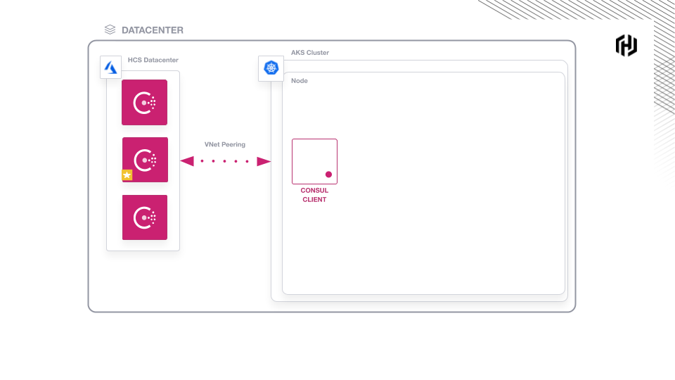

### Create Helm configuration

Generate the helm config file that you will apply to AKS.

`az hcs generate-helm-values --name $HCS_MANAGED_APP --resource-group $RESOURCE_GROUP --aks-cluster-name $AKS_CLUSTER > config.yaml`{{execute T1}}

Uncomment line 29 so that gossip ports are exposed.

`sed -i -e 's/^  # \(exposeGossipPorts\)/  \1/' config.yaml`{{execute T1}}

Review the `config.yaml`{{open}} file.

### Deploy Consul clients

Deploy Consul to AKS using the `config.yaml`.

`helm install hcs hashicorp/consul -f config.yaml --version "0.30.0" --wait`{{execute T1}}

Example output:

```plaintext
NAME: hcs
...TRUNCATED
  $ helm get all hcs
```

Verify that Consul is deployed and running.

`watch kubectl get pods`{{execute T1}}

The deployment is complete when all pods are `Ready` with a
status of `Running`.

```plaintext
NAME                                         READY   STATUS    RESTARTS   AGE
consul-5nmmx                                 1/1     Running   0          2m3s
consul-connect-injector-webhook-deployment   1/1     Running   0          2m3s
```

Now your environment looks like this:

