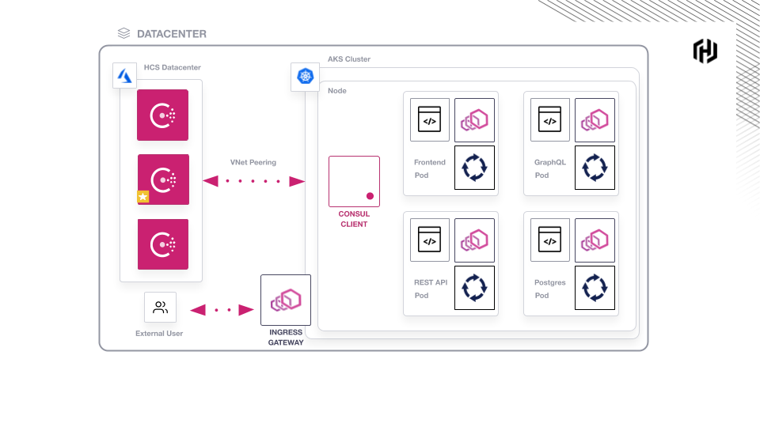

You will need to configure an ingress gateway to use the demo application.

### Create a config entry

An ingress gateway in Consul belongs to a class of resources called
config entries. Open `ingress-gateway.hcl`{{open}} to review
a baseline ingress gateway config entry. Specifically, note
that the ingress gateway is configured to expose port `8080` to external
traffic.

Now, register the config entry with Consul.

`consul config write ingress-gateway.hcl`{{execute interrupt T1}}

### Upgrade Consul to use the ingress gateway

To register the ingress gateway with Kubernetes, you must
update the `config.yaml`, and add a top level `ingressGateways`
stanza. Click below to add the stanza.

```shell-session
sudo tee -a ./config.yaml <<EOF
ingressGateways:
  enabled: true
  defaults:
    replicas: 1
  gateways:
    - name: ingress-gateway
      service:
        type: LoadBalancer
EOF
```{{execute T1}}

Open `config.yaml`{{open}} and review its contents.

Use `helm upgrade` to apply the updated `config.yaml` values.

`helm upgrade -f ./config.yaml hcs hashicorp/consul --wait`{{execute T1}}

Example output:

```plaintext
NAME: hcs
...OMITTED
  $ helm get all hcs
```

Now your environment looks like this:


