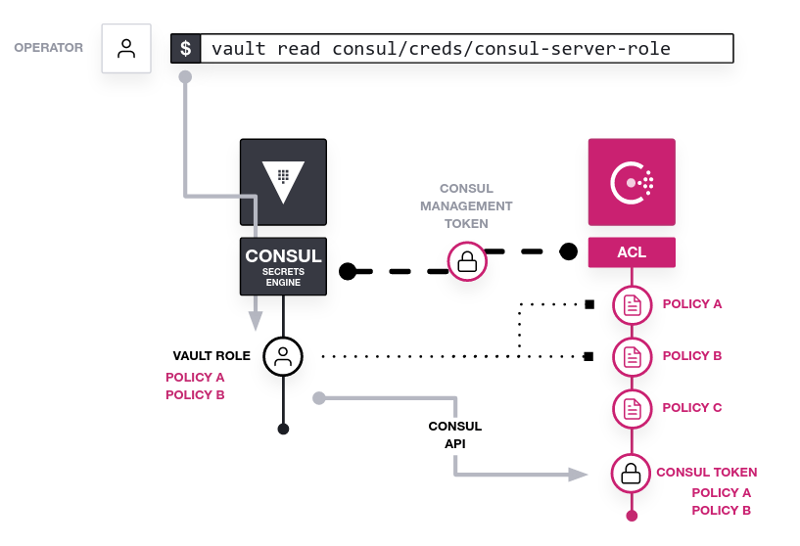

# Secure Consul Agent Communication with ACL

In this hands-on lab, you will deploy a secure Consul
datacenter using Vault to generate and manage ACL tokens.

The lab will guide you through the steps necessary to deploy Consul
with ACLs enabled to secure access to the cluster data and define agents' permissions.

<!-- Suggestion
I'm not sure "verify identity" is the correct phrasing. Maybe something like "deploy a Consul datacenter with ACLs enabled to secure access to the cluster data and agents". Cluster data meaning the catalog. Agents meaning accessing (managing) them with the UI/CLI/API.
-->

Specifically, you will:
- Start a Vault dev instance
- Start a Consul datacenter with ACL enabled
- Bootstrap ACLs in Consul
- Create a Consul policy for servers
- Enable the Consul secrets engine in Vault
- Create a management token for Vault
- Create a Vault role to map Consul policy
- Create a Vault token associated with the role
- Verify the token was present in Consul and apply it to the agent

If you are already familiar with the basics of Consul, but are not familiar with Consul ACL system encryption review the
[Secure Consul with ACLs](https://learn.hashicorp.com/consul/security-networking/production-acls) tutorial and learn how to enable and use ACLs on your Consul datacenter.
