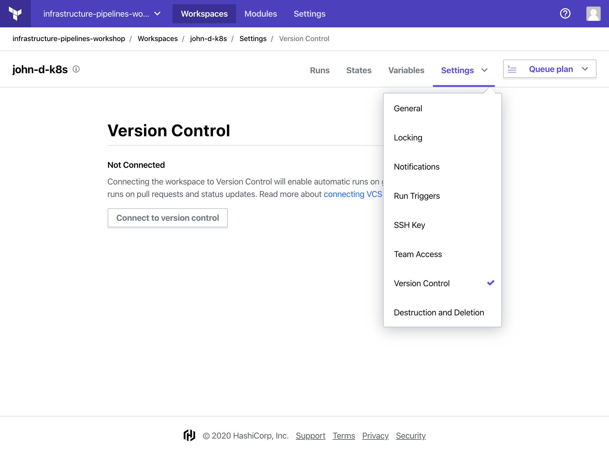

## Setup Terraform Cloud workspaces

In this step, you will locate your pre-configured workspaces (Kubernetes, Consul, Vault) in Terraform Cloud. Then, you will connect them to a version control system (VCS), verify the variables are set up properly, then set up run triggers connecting the workspaces.

Check the email address you used to sign up for the workshop. You should find an invitation to join the `infrastructure-pipelines-workshop` workshop. Accept the invite. You should find 3 workspaces starting with your first name and middle initial.  For example, if your name is John Doe, you should see:

- `john-d-k8s`
- `john-d-consul`
- `john-d-vault`

These will be your workspaces for the duration of this workshop.

## Configure Kubernetes workspace

Fork the [Learn Terraform Pipelines K8s repository](https://github.com/hashicorp/learn-terraform-pipelines-k8s). Replace the `organization` and `workspaces` values in [`main.tf`](https://github.com/hashicorp/learn-terraform-pipelines-k8s/blob/master/main.tf). 
- `organization = "infrastructure-pipelines-workshop"`
- `workspaces   = "{firstName}-{lastInitial}-k8s"`

```hcl
terraform {
  backend "remote" {
    organization = "infrastructure-pipelines-workshop"

    workspaces {
      name = "john-d-k8s"
    }
  }
}
```
### Connect workspace to forked repository

Click on your Kubernetes workspace (`john-d-k8s`). Click on "Settings" then "Version Control" to access workspace's version control.



Then, click on "Connect to version control". Select "Github" — it will ask you to authorize GitHub if this is your first time using Terraform Cloud. Select your **forked** Kubernetes repo: `learn-terraform-pipelines-k8s`. Finally, click "Update VCS settings". This will connect this workspace to your forked Kubernetes repo.

### Verify variables

Next, click on "Variables". Both your Terraform Variables and Environment Variables should already be set for you. These correspond with the variables in [`variables.tf`](https://github.com/hashicorp/learn-terraform-pipelines-k8s/blob/master/variables.tf). Verify your variables have been set correctly.

#### Terraform Variables
- **region** — GCP region to deploy clusters<br/>
  This should be set to `europe-west4`. For a full list of GCP regions, refer to [Google’s Region and Zones documentation](https://cloud.google.com/compute/docs/regions-zones).
- **password** — Password for Kubernetes cluster<br/>
  This can be anything over 16 characters, but defaults to `infrastructurepipelines`. This should have been marked **sensitive**. Terraform will set this when it creates your Kubernetes cluster and will distribute it as necessary when creating your Consul and Vault clusters. You do not need to manually input this value again.
- **enable_consul_and_vault** — Enable Consul and Vault for the secrets cluster<br/>
  This should be set to `false`. This variable dictates whether Consul and Vault should be deployed on your Kubernetes cluster.
- **username** — Username for Kubernetes cluster<br/>
  This can be anything, but defaults to `hashicorp`.
- **google_project** — Google Project to deploy cluster<br/>
  This should be set to `{firstName}-{lastInitial}-{randomString}`.
- **cluster_name** — Name of Kubernetes cluster<br/>
  This should be set to `tfc-pipelines`.

#### Environment Variables
- **GOOGLE_CREDENTIALS** — Flattened JSON of your GCP credentials.<br/>
  This should have already been set for you and marked **sensitive**. It has access to both **Compute Admin** and **GKE Admin**

## Deploy Kubernetes cluster

Click on "Run", you should see a queued plan. If the plan is successful, Terraform cloud will display a notice that a run will automatically queue a plan in the Consul workspace, and ask you to confirm and apply.

Click "Confirm & Apply" to apply this configuration. This process should take about 10 minutes to complete. 

While your Kubernetes cluster deploying, continue onto the next step and configure your Consul workspace.

## Next steps

You have successfully configured your Kubernetes workspace. Terraform cloud will use these values to deploy your Kubernetes cluster. The pipeline will output the Kubernetes credentials for the Helm charts to consume in the Consul and Vault workspaces. These values are specified in [`output.tf`](https://github.com/hashicorp/learn-terraform-pipelines-k8s/blob/master/outputs.tf).

In the next step, you will configure your Consul workspace.

