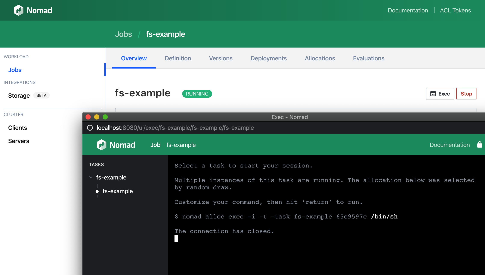

## Enable WebSocket connections

As of Nomad 0.11.0, the Web UI has supported [interactive exec sessions with any
running task in the cluster][exec]. This is achieved using the exec API which is
implemented using WebSockets.

WebSockets are necessary for the exec API because they allow bidirectional data
transfer. This is used to receive changes to the remote output as well as send
commands and signals from the browser-based terminal.

The way a WebSocket connection is established is through a handshake request.
The handshake is an HTTP request with special `Connection` and `Upgrade`
headers.

WebSockets also do not support CORS headers. The server-side of a WebSocket
connection needs to verify trusted origins on its own. Nomad does this
verification by checking if the `Origin` header of the handshake request is
equal to the address of the Nomad API.

By default NGINX will not fulfill the handshake or the origin verification. This
results in exec sessions immediately terminating. You can experience this in the
Web UI by navigating to the [sample job], clicking the Exec button, selecting the
task, and attempting to run the command `/bin/sh`.



The fulfill the handshake NGINX will need to forward the `Connection` and
`Upgrade` headers. To meet the origin verification required by the Nomad API,
NGINX will have to override the existing `Origin` header to match the host
address. Add the following to the top of the`location` block of the existing
NGINX configuration file.

<pre class="file" data-filename="nginx.conf" data-target="insert" data-marker="    location / {">
    location / {
      # The Upgrade and Connection headers are used to establish
      # a WebSockets connection.
      proxy_set_header Upgrade $http_upgrade;
      proxy_set_header Connection "upgrade";

      # The default Origin header will be the proxy address, which
      # will be rejected by Nomad. It must be rewritten to be the
      # host address instead.
      proxy_set_header Origin "${scheme}://${proxy_host}";
</pre>

Restart the NGINX docker container to load these configuration changes.

```
docker restart nomad-proxy
```{{execute}}

WebSocket connections are also stateful. If you are planning on using NGINX to
balance load across all Nomad server nodes, it is important to ensure that
WebSocket connections get routed to a consistent host.

This can be done by specifying an upstream in NGINX and using it as the proxy
pass. Add the following to the top of the http block in the existing NGINX
configuration file.

<pre class="file" data-filename="nginx.conf" data-target="insert" data-marker="http {">
http {
  # Since WebSockets are stateful connections but Nomad has multiple
  # server nodes, an upstream with ip_hash declared is required to ensure
  # that connections are always proxied to the same server node when possible.
  upstream nomad-ws {
    ip_hash;
    server [[HOST_IP]]:4646;
  }

</pre>

Traffic must also pass through the upstream. To configure this, change the `proxy_pass`
in the NGINX configuration file.

<pre class="file" data-filename="nginx.conf" data-target="insert" data-marker="    location / {">
    location / {
      # Use the stateful upstream to facilitate WebSocket connections.
      proxy_pass https://nomad-ws;
</pre>

Since this development environment only has one node, this change has no
observable effect.

[sample job]: https://[[HOST_SUBDOMAIN]]-8000-[[KATACODA_HOST]].environments.katacoda.com/jobs/fs-example
[exec]: https://www.hashicorp.com/blog/hashicorp-nomad-remote-exec-web-ui
