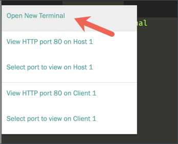

Vault Agent runs on the **client** side to automate leases and tokens lifecycle management.


For this scenario, you are going to run the Vault Agent on the same machine as where the Vault server is running. However, the basic working is the same except the host machine address.

Login with root token.

> Click on the command (`⮐`) will automatically copy it into the terminal and execute it.

```
vault login root
```{{execute T1}}

First, setup the auth method on the Vault server. In this example, you are going to enable [`approle`](https://www.vaultproject.io/docs/auth/approle.html) auth method.

```
vault auth enable approle
```{{execute T1}}

Create a policy named, "token_update" which is defined by the `token_update.hcl`{{open}} file.

```
vault policy write token_update token_update.hcl
```{{execute T1}}

Execute the following command to create a role named, "apps" with `token_update` policy attached.

```
vault write auth/approle/role/apps policies="token_update"
```{{execute T1}}

Now, generate a role ID and stores it in a file named, "roleID".

```
vault read -format=json auth/approle/role/apps/role-id \
        | jq  -r '.data.role_id' > roleID
```{{execute T1}}

The `approle` auth method allows machines or apps to authenticate with Vault using Vault-defined roles. The generated `roleID`{{open}} is equivalent to username.

Also, generate a secret ID and stores it in the "secretID" file.

```
vault write -f -format=json auth/approle/role/apps/secret-id \
        | jq -r '.data.secret_id' > secretID
```{{execute T1}}

The generated `secretID`{{open}} is equivalent to a password.

Refer to the [_AppRole Pull Authentication_](https://learn.hashicorp.com/vault/identity-access-management/iam-authentication) guide to learn more.

<br>

## Vault Agent Configuration

Examine the Vault Agent configuration file, `agent-config.hcl`{{open}}.

```
exit_after_auth = false
pid_file = "./pidfile"

auto_auth {
   method "approle" {
       mount_path = "auth/approle"
       config = {
           role_id_file_path = "roleID"
           secret_id_file_path = "secretID"
           remove_secret_id_file_after_reading = false
       }
   }

   sink "file" {
       config = {
           path = "approleToken"
       }
   }
}

vault {
   address = "http://127.0.0.1:8200"
}
```

The `auto_auth` block points to the `approle` auth method, and the acquired token gets stored in `approleToken` file which is the sink location.


Execute the following command to start the Vault Agent with `debug` logs.

```
vault agent -config=agent-config.hcl -log-level=debug
```{{execute T1}}

The agent log should include the following messages:

```
...
[INFO]  sink.file: creating file sink
[INFO]  sink.file: file sink configured: path=approleToken
[INFO]  auth.handler: starting auth handler
[INFO]  auth.handler: authenticating
[INFO]  sink.server: starting sink server
[INFO]  auth.handler: authentication successful, sending token to sinks
[INFO]  auth.handler: starting renewal process
[INFO]  sink.file: token written: path=approleToken
...
```

The acquired client token is now stored in the `approleToken`{{open}} file.  Your applications can read the token from `approleToken` and use it to invoke the Vault API.

Click the **+** next to the opened Terminal, and select **Open New Terminal** to open another terminal.



Execute the following command to verify the token information.

```
export VAULT_ADDR='http://127.0.0.1:8200'

vault token lookup $(cat approleToken)
```{{execute T2}}

Verify that the token has the token_update policy attached.

```
Key                  Value
---                  -----
...
display_name         approle
entity_id            f06b5047-6174-eda5-8530-d067c77e26bc
expire_time          2019-05-19T01:32:26.451100637Z
explicit_max_ttl     0s
id                   s.YKo3MLA6dSshKgeStGuIxIsJ
...
meta                 map[role_name:apps]
...
path                 auth/approle/login
policies             [default token_update]
...
```

You should be able to create a token using this token (permitted by the `token_update` policy).

```
VAULT_TOKEN=$(cat approleToken) vault token create
```{{execute T2}}
