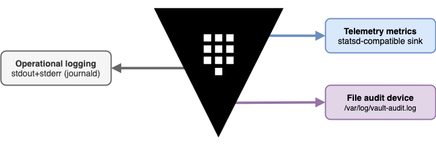

<small>Tutorial v0.2.4 accompanies the information in [Monitoring Telemetry with Splunk](https://learn.hashicorp.com/vault/monitoring/monitor-telemetry-audit-splunk)</small>

----

Vault emits rich operational and usage data to provide its users insight and intelligence about the server lifecycle. Two such streams of data available from an operating Vault server through [telemetry metrics](https://www.vaultproject.io/docs/internals/telemetry) and [audit device](https://www.vaultproject.io/docs/audit) logs.

    

<small>In addition to operational and audit logging, Vault can also export operational data in the form of audit devices and telemetry metrics.</small>

You can configure an agent like Fluentd to read a Vault file audit device log and export it to Splunk, and you can also [configure telemetry](https://www.vaultproject.io/docs/configuration/telemetry) for either exporting metrics or pulling metrics depending on the solution you use. Aggregated metrics can then be visually analyzed with dashboards and alerted on based on your business and operational criteria.

This scenario helps you become familiar with Vault telemetry in Splunk. It uses Terraform to automate deployment of a simple Docker based infrastructure featuring a Vault server (v1.4.3), a Fluentd td-agent (v1.11), a Telegraf agent(v1.12.6), and a Splunk server (v8.0.4.1).

You a will gain basic idea of what is possible and help inform your own telemetry aggregation and analysis solution by assembling and using the solution in this scenario.

You will perform these tasks while you work through the scenario:

1. **Start the containers** - this is where Terraform helps to automate deployment. By defining and applying a plan, you can orchestrate the entire deployment, down to all required configuration items for each component of the stack.
1. **Prepare Vault** - Prepare Vault for use by initializing it and unsealing it. You will also authenticate to Vault with the initial root token and enable a file audit device.
1. **Access Splunk Web** - Access the Splunk Web UI and initial Vault telemetry metrics.
1. **Perform actions to generate metrics** - Vault generates some runtime metrics even in an uninitialized and sealed state, but in this step you will generate additional metrics that you can then revisit in Splunk.
1. **Analyze generated metrics** - Use Splunk Web to analyze, search, and visualize your Vault telemetry metrics including a simple dashboard.

----

Click **START SCENARIO** to begin.
