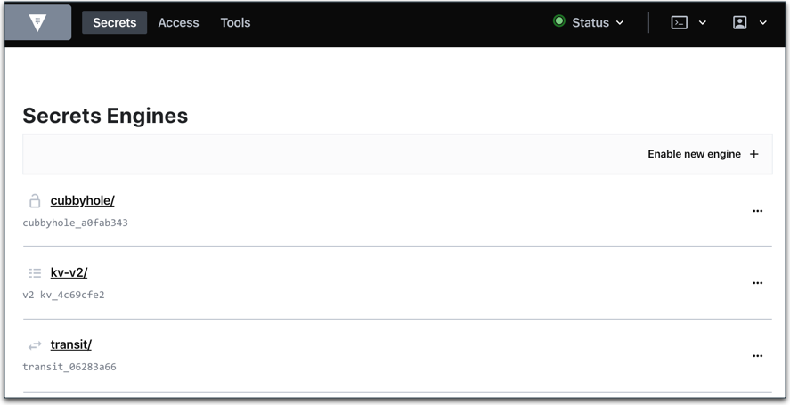
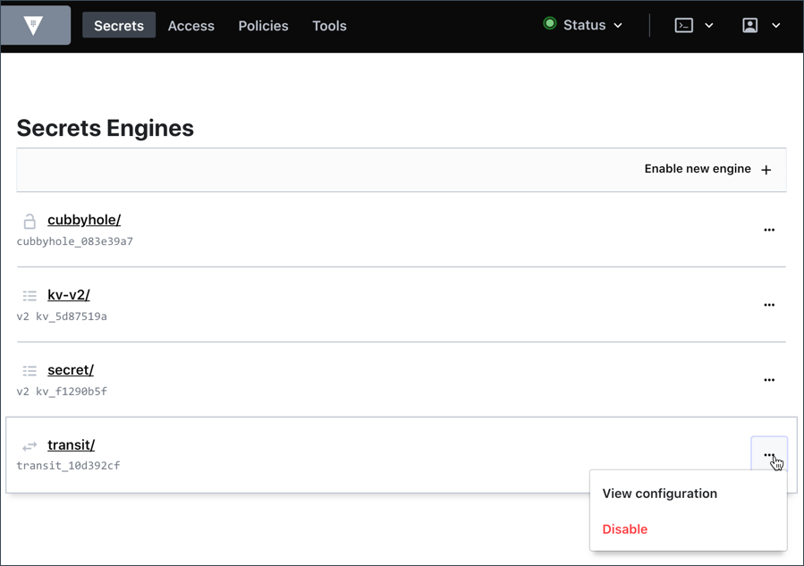
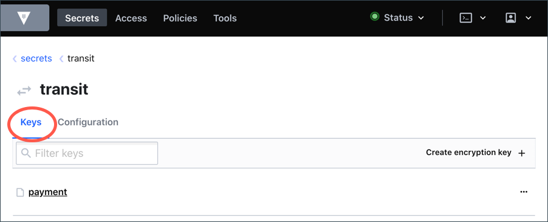
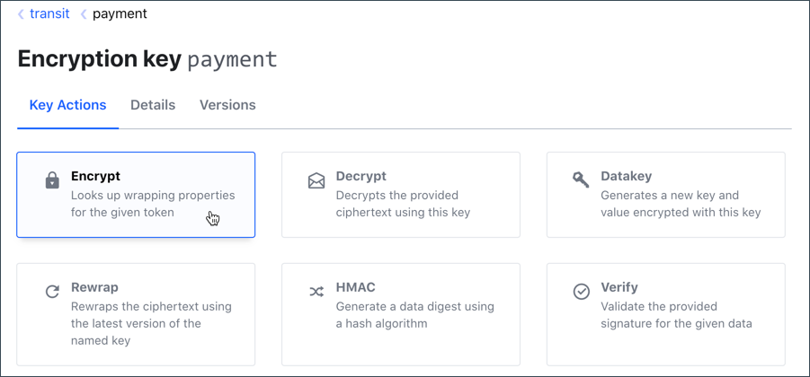
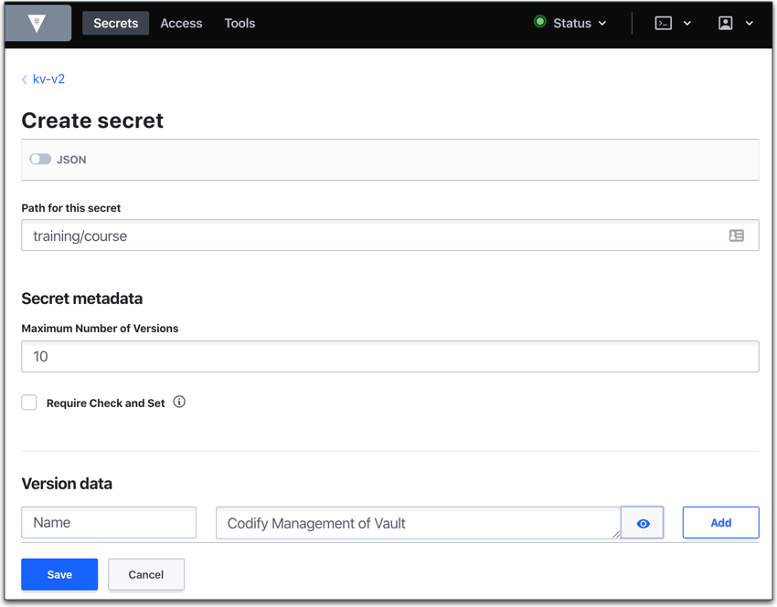

Verify to make sure that Vault has been configured as defined in the `main.tf`.

List existing policies to make sure that `admins` and `eaas-client` policies were created.

```
vault policy list
```{{execute T1}}

List enabled secrets engines to verify that kv-v2 and transit secrets engines are enabled.

```
vault secrets list
```{{execute T1}}

## Verify the student user

1. Click on the **Vault UI** tab to launch the Vault UI.

  

1. Select **Username** from the **Method** drop-down list, and enter `student` in the **Username** text field and `changeme` in the **Password** text field.

  

1. Click **Sign In**. You should see that `kv-v2` and `transit` are listed.

  

1. Select **View configuration** of the **transit** secrets engine.

  

1. Select **Keys** tab and verify that **payment** key exists.

  

1. Select **payment** and then **Encrypt**.

  

1. Enter `1111-2222-3333-4444` in the **Plaintext** field, and then click **Encrypt**.

  

1. Click **Copy & Close**.

1. Now, select **Decrypt** tab and paste in the ciphertext you just copied.

1. Click **Decrypt**.

1. The returned plaintext is base64 encoded. Click **Copy & Close**.

1. Execute the `base64 --decode` command to decode the returned plaintext.

  **Example:**

  ```
  base64 --decode <<< "MTExMS0yMjIyLTMzMzMtNDQ0NAo="
  ```

1. Select **Secrets** to return to the **Secrets Engines** list.

  

1. Select `kv-v2` and click **Create secret**.

1. Enter `training/course` in the **Path for this secret** text field. In the key text field under **Version data**, enter `Name`, and `Codify Management of Vault` in the value text field.

  

1. Click **Save**.

> **NOTE:** The details about how transit secrets engine works are out of scope for this tutorial. If you are not familiar with transit secrets engine, read the [Encryption as a Service: Transit Secrets
Engine](https://www.katacoda.com/hashicorp/scenarios/vault-transit) tutorial.


## Clean up

When you are done exploring, you can undo the configuration made by Terraform.

First log back in with the client token used to run the terraform commnands.

```
vault login root
```{{execute T1}}

Destroy the Vault resources created by Terraform.

```
terraform destroy -auto-approve
```{{execute T1}}

Remove the terraform state files.

```
rm *.tfstate.*
```{{execute T1}}
